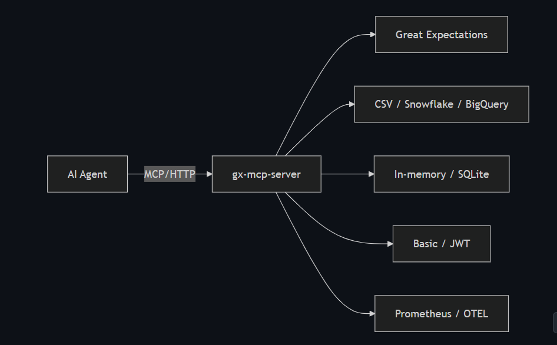

# Bridging AI and Data Quality: How I Built gx-mcp-server

**Author’s Note**
I’m David Front - coding since the 1980s, from scientific computing to global web services. Today, I’m happy to shift focus to be coding by coordinating the work of AI agents. gx-mcp-server is my first open-source contribution.

***

## 1. Introduction

AI agents excel at language but lack built‑in data validation. Great Expectations (GE) provides battle‑tested data-quality checks, but typically via scripts or batch jobs. **gx-mcp-server** changes that by exposing GE as an MCP‑compliant service, letting agents load data, define rules, run validations, and interpret results programmatically.

You’ll learn:

- Why autonomous data validation matters for AI workflows
- How MCP standardizes agent–tool interactions
- gx-mcp-server’s core design and key features
- A walkthrough and an automated test script
- Deployment tips, metrics scraping, and next steps

## 2. Motivation & Challenge

AI pipelines ingest real-world CSVs, databases, and logs. Bad data—nulls, malformed fields, drift—can break downstream tasks. Traditional GE workflows (write suites, schedule jobs, review reports) aren’t realtime or agent‑friendly. Agents need an API: “Is this data valid?” **gx-mcp-server** fills that gap.

## 3. Model Context Protocol (MCP)

MCP is an open JSON‑RPC standard for AI agents to discover and call external tools securely. By speaking MCP, gx-mcp-server integrates with any MCP‑aware client—Claude, custom LLM orchestrators, or future platforms—without custom adapters.

## 4. Architecture Overview




- **Protocol Handler**: FastMCP over HTTP, STDIO, Inspector.
- **HTTP Layer**: FastAPI with CORS, origin checks, rate limiting.
- **Core**: GE suites, profiling, checkpoints.
- **Storage & Security**: In-memory or SQLite; Basic/JWT auth.
- **Observability**: `/metrics` for Prometheus; OTEL tracing.

## 5. Key Features

- **Flexible Sources**: Inline/local/URL CSV (up to 1 GB), Snowflake, BigQuery.
- **Dynamic Suites**: Create/update expectation suites; optional GE profiler.
- **Sync & Async**: Quick checks or background jobs.
- **Security**: Basic and Bearer‑token auth, CORS, rate limits.
- **Observability**: Prometheus scraping and OpenTelemetry spans.
- **Transports**: HTTP, STDIO, Inspector.

Each choice balances ease‑of‑use with production readiness.

## 6. Quick Start

**Install**

```bash
pip install gx-mcp-server
```

**Docker**

```bash
docker run -d -p 8000:8000 --name gx-mcp-server davidf9999/gx-mcp-server:latest
```

**Health**

```bash
curl http://localhost:8000/mcp/health
# {"status":"ok"}
```

Point your agent at `http://localhost:8000/mcp/`.

## 7. Walkthrough & Demo Script

For readers who want a **hands‑on check**, the repo includes a fully‑automated smoke test:

> **scripts/****gx\_request\_response\_demo****.py** – spins up `gx‑mcp‑server`, loads a demo CSV, runs a checkpoint, prints the results, then shuts the server down.
>
> ```bash
> # clone & run
> git clone https://github.com/davidf9999/gx-mcp-server && cd gx-mcp-server
> python scripts/gx_request_response_demo.py
> ```
>
>

### What the server sees

Below are **two concise MCP exchanges** so you can visualize the round‑trip:

1️⃣ `load_dataset` – inline CSV (two rows)

```jsonc
// request
{
  "method": "tools/call",
  "params": {
    "name": "load_dataset",
    "arguments": {
      "source_type": "inline",
      "source": "id,age\\n1,25\\n2,19"
    }
  }
}

// response (truncated)
{
  "result": {
    "handle": "dset‑1234…",
    "rows": 2,
    "columns": ["id", "age"]
  }
}
```

2️⃣ `run_checkpoint` – validate `age ∈ 21-65`, returns a failure for row 2

```jsonc
// request (after expectation has been added)
{
  "method": "tools/call",
  "params": {
    "name": "run_checkpoint",
    "arguments": {
      "dataset_handle": "dset‑1234…",
      "suite_name": "age_range_suite"
    }
  }
}

// response (excerpt)
{
  "result": {
    "success_percent": 50.0,
    "failing_rows": [
      {"id": 2, "age": 19}
    ]
  }
}
```

### Calling from an LLM

(Claude CLI)

Once the server is running you can let **Claude** do the same work:

```bash
# register the server once
claude mcp add gx http://localhost:8000/mcp/

# natural‑language request • Claude assembles the MCP calls for you
claude "Load CSV id,age
1,25
2,19 and validate age 21‑65; show failed rows"
```

Claude will send the `load_dataset`, create an expectation on `age`, run a checkpoint, and reply with the failed rows—no extra code needed.

*(Any MCP‑aware agent follows the same pattern.)*

---

## 8. Deployment, Metrics & Maintenance

- **Prometheus scraping**: in `prometheus.yml`:
  ```yaml
  scrape_configs:
    - job_name: gx-mcp-server
      static_configs:
        - targets: ['localhost:8000']
      metrics_path: '/metrics'
      scheme: 'http'
  ```
- **Docker**: pin tags, mount `config.yaml` for auth and metrics.
- **CI/CD**: GitHub Actions build & push.
- **Tracing**: `--trace` with OTLP exporter for Jaeger/Zipkin.

## 9. Future Work & Roadmap

- **REST APIs**: load JSON from endpoints for validation (e.g., `load_dataset('http://api/data')`).
- **Predictive Quality Monitoring**: use historical metrics to detect drift and trigger alerts.
- **Auto‑Generated Expectations**: GE’s profiler offers basic generation; next up: AI‑driven rule suggestions.
- **Kubeflow Hooks**: integrate as pipeline steps or Argo tasks in MLOps workflows.\*

## 10. Conclusion & Call to Action

gx‑mcp‑server bridges enterprise‑grade data validation and autonomous AI agents. By wrapping Great Expectations in an MCP‑compliant service, you can embed data‑quality checks directly inside your LLM workflows—no bespoke glue code required.

**Ready to try it?**

```bash
docker pull davidf9999/gx-mcp-server:latest
python scripts/gx_request_response_demo.py   # end‑to‑end test
```

• GitHub → [https://github.com/davidf9999/gx-mcp-server](https://github.com/davidf9999/gx-mcp-server)\
• PyPI → `pip install gx-mcp-server`

🌟 Star the repo, open issues, or submit PRs—community feedback drives the roadmap!

